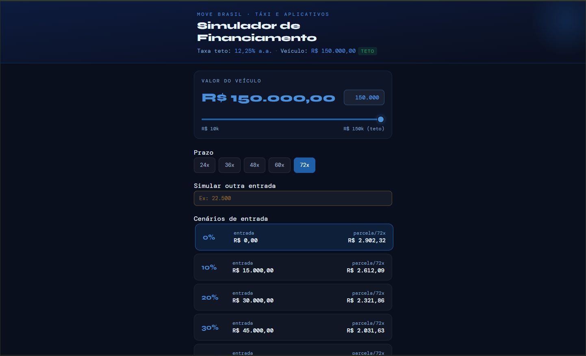
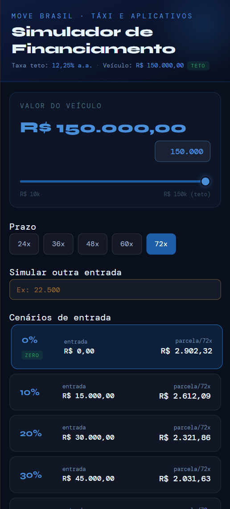

# Move Brasil · Financing Simulator

A clean, interactive financing simulator for the **Move Brasil** program — the Brazilian federal government's credit line for taxi drivers and rideshare app drivers (Uber, 99, etc.).

Live at **[niksonndev.github.io/move-brasil](https://niksonndev.github.io/move-brasil/)**

## Screenshots




---

## About the Program

Move Brasil is a federal initiative offering subsidized vehicle financing to registered taxi drivers and active rideshare drivers. Key terms:

- Vehicle value up to **R$ 150,000**
- Rate ceiling: **12.25% p.a.** (2.5% government + 8.5% bank + 1.25% BNDES)
- Up to **72 months** to pay, with optional 6-month grace period
- **Zero down payment** option available
- Credit guarantee via FGI-PEAC (covers up to 80% of credit risk)
- Available from **June 19, 2026**

## What This Simulator Does

- Adjust the **vehicle value** via slider (R$ 10k–R$ 150k)
- Compare **6 down payment scenarios** (0% to 50%) side by side
- Enter a **custom down payment** amount
- Switch between **5 loan terms** (24, 36, 48, 60, 72 months)
- See installment value, total paid, and true cost of credit for each scenario

All calculations use the rate ceiling. Actual rate depends on the financial institution.

## Stack

- [React 18](https://react.dev/)
- [Vite 5](https://vitejs.dev/)
- Deployed via GitHub Actions → GitHub Pages

## Running Locally

```bash
pnpm install
pnpm dev
```

## License

MIT
